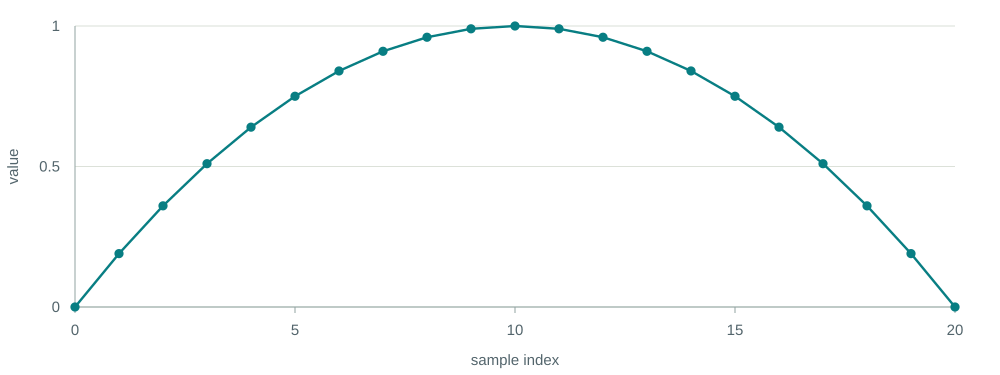
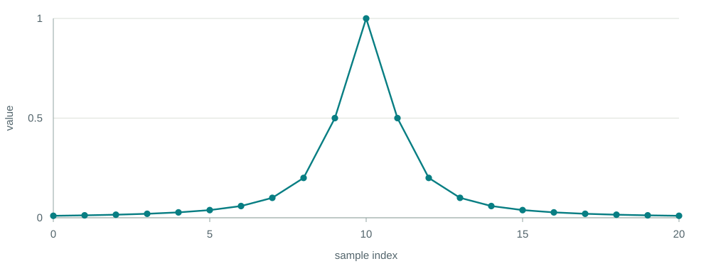
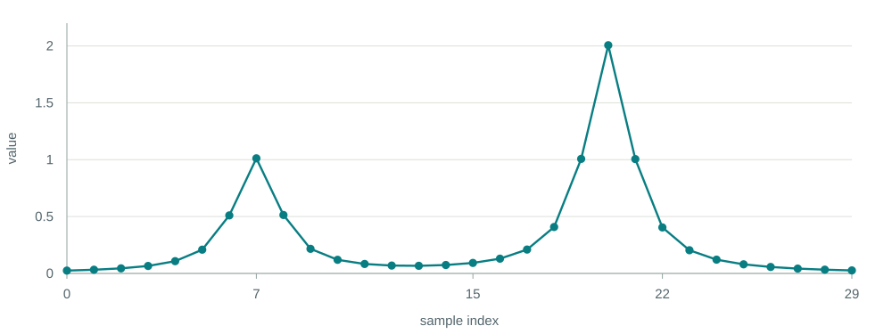
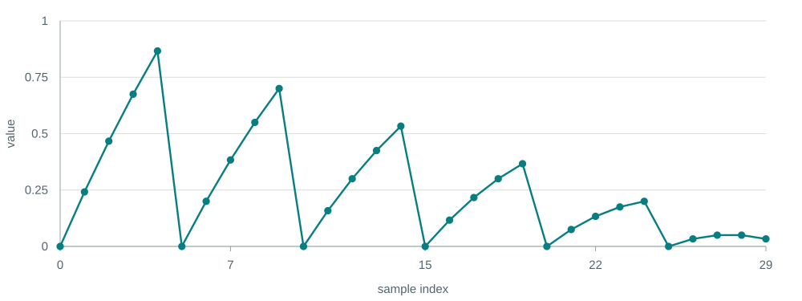
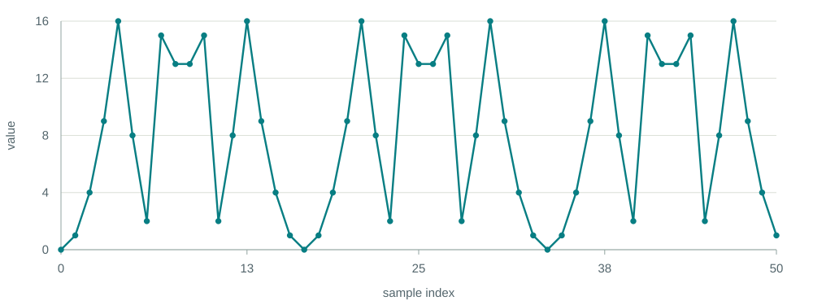

<div class="kicker">ACTAM 2026 · Exercise</div>

<h1 class="cover-title">Draw it with<br>a list</h1>


<div class="cover-meta">Expressions · comprehensions · discrete samples</div>

---

# Read the plot, then write the list

Each dot is one value. The horizontal position is its **index** in the list.

Write a comprehension that produces a similar plot. Use arithmetic, `range`, and the list operations from our first lesson. **No imports needed.**

```python
y = [ ... for x in range(...) ]
```

There may be several good answers. Start with the first few points, then look at the whole shape.

---

<div class="kicker">Plot 01 · 21 samples</div>

# A broad hill



<p class="exercise-prompt">Can one expression create both sides of the hill?</p>

---

<div class="kicker">Plot 02 · 21 samples</div>

# A narrow peak



<p class="exercise-prompt">What changes quickly near the center and slowly far away?</p>

---

<div class="kicker">Plot 03 · 30 samples</div>

# Two unequal peaks



<p class="exercise-prompt">Can two simple shapes add up to this one?</p>

---

<div class="kicker">Plot 04 · 30 samples</div>

# A pattern that fades



<p class="exercise-prompt">The pattern repeats, but each repetition is smaller.</p>

---

<div class="kicker">Plot 05 · optional stretch · 51 samples</div>

# An irregular-looking pattern



<p class="exercise-prompt">It is made from integers. Can you find where it starts again?</p>

---

# Keep your attempts

For each plot, save your comprehension and one sentence about how you approached it.

Commit a first attempt. Then improve one plot, make a second commit, and share your repository link.

Which plot allowed more than one convincing answer?
